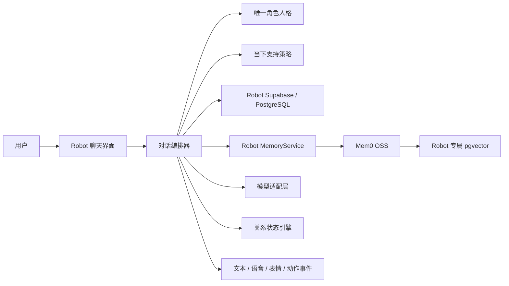
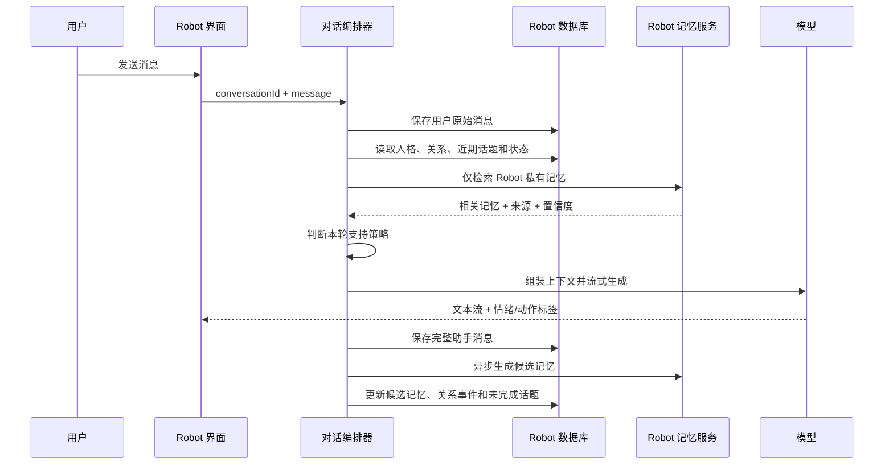

# Robot 专属陪伴系统：顶层设计

版本：0.2
边界：仅当前项目内的对话启用人格、长期记忆、关系状态和情绪价值能力。

## 1. 正确的产品定义

Robot 是一个独立的私人陪伴应用，不是给其他项目提供记忆的公共服务。

```text
当前项目内的对话
  = 专属人格 + Robot 私有记忆 + 关系状态 + 日记 + 未完成话题

其他项目内的对话
  = 原有项目行为
  = 不读取 Robot 记忆
  = 不继承 Robot 人格和关系状态
```

这里的“差异化”是：你进入 Robot 聊天时，会获得明显不同于其他项目的情绪体验。不是让 Robot 根据不同项目切换多个角色，也不是把 Robot 的记忆分发给其他项目。

## 2. 产品目标

Robot 要逐渐成为一个稳定、连续、了解你的专属角色：

- 记得你的偏好、目标、重要经历和明确边界。
- 知道你们之前聊过什么，能继续未完成的话题。
- 根据当下状态选择倾听、安慰、梳理、建议或督促。
- 关系会随着真实互动逐渐熟悉，但不会用虚假的“好感度”操纵体验。
- 所有记忆都能查看、修改、冻结、删除和追溯来源。
- 数据默认留在 Robot 自己的本地数据库中。
- 未来接入语音、Live2D 或桌宠时，不需要重写聊天和记忆系统。

## 3. 项目隔离原则

Robot 必须在四个层面与其他项目隔离：

### 3.1 代码隔离

- 所有应用代码、提示词、角色配置和迁移文件只放在当前项目。
- 不修改用户级、系统级的全局提示词或全局记忆配置。
- 不把人格规则写入会影响其他目录的全局配置。

### 3.2 数据隔离

- Robot 使用独立的 PostgreSQL 数据库或独立 Supabase 实例。
- Mem0 使用 Robot 专属 collection/namespace。
- 不扫描其他项目的聊天记录、源码和文档。
- 除非你主动导入文件，否则 Robot 只知道 Robot 内发生的内容。

### 3.3 身份隔离

- 所有记忆绑定固定的 `robot_user_id`。
- 关系状态只存在于 `robot_user_id × robot_persona_id`。
- API 必须校验用户身份，不能仅依赖前端传来的 ID。

### 3.4 运行隔离

- Robot 的环境变量只放在项目自己的 `.env.local` 中。
- 数据库、Mem0 和本地模型只绑定本机地址。
- 其他项目不提供 Robot Memory API 的调用配置。

## 4. 推荐技术架构



推荐组件：

- 前端：Next.js App Router。
- 聊天流：Vercel AI SDK。
- 主数据：本地 Supabase/PostgreSQL。
- 向量检索：pgvector。
- 长期记忆：Mem0 OSS，隐藏在自定义 `MemoryService` 接口后。
- 模型：支持云端模型和 Ollama，通过统一适配层切换。
- 后期交互：STT、TTS、Live2D 或桌宠订阅统一输出事件。

## 5. 数据主权

Supabase 是唯一事实源，Mem0 是可重建的记忆处理和检索层。

```text
原始会话、正式记忆、关系事件、日记
                ↓
       Supabase / PostgreSQL
                ↓
       Mem0 提炼与向量索引
```

不能只把数据交给 Mem0，原因是 Robot 还需要：

- 显示记忆来源。
- 允许用户纠错和撤销。
- 管理敏感级别和有效期。
- 删除后清理所有索引。
- Mem0 故障后重建检索数据。

## 6. Robot 内部的记忆分层

这里没有“跨项目共享范围”，只有 Robot 内部不同用途的记忆。

| 层级 | 内容 | 默认行为 | 示例 |
|---|---|---|---|
| 原始会话 | 完整用户与助手消息 | 永久保存或按设置清理 | 一次完整对话 |
| 用户事实 | 用户明确表达的稳定事实 | 可长期记忆 | 工作、生活背景 |
| 偏好与边界 | 喜欢的回应方式和禁区 | 优先影响回复 | 不喜欢空泛鼓励 |
| 共同经历 | Robot 和用户聊过的重要事情 | 用于保持连续感 | 上次做出的决定 |
| 长期目标 | 用户持续推进的目标 | 适度回访 | 学习、健康计划 |
| 临时状态 | 当天情绪、精力和处境 | 自动过期 | 今天疲惫、焦虑 |
| 日记 | 用户确认保存的完整记录 | 默认不自动引用 | 一篇生活复盘 |
| 未完成话题 | 需要下次继续的内容 | 经授权后回访 | 等待某个结果 |

关键规则：

- 临时情绪必须设置有效期，不能变成永久人格判断。
- “今天不想做事”不能被写成“你是一个没有执行力的人”。
- AI 推断出的性格默认只作为待确认候选。
- 用户当前表达与旧记忆冲突时，以当前表达优先。

## 7. 结构化角色人格

Robot 首版只做一个核心角色，并把它做深。人格不只是一段描述，而是一组可测试的配置：

```text
RobotPersona
├── identity             身份定位和称呼
├── emotional_goal       希望用户聊完后获得什么
├── warmth               温暖程度
├── directness           直接程度
├── challenge_level      是否指出回避和矛盾
├── humor_level          幽默与玩笑边界
├── response_length      默认回复长度
├── support_sequence     共情、澄清、建议的顺序
├── initiative_level     主动回访程度
├── relationship_style   朋友、伙伴、教练或混合
├── vocabulary           习惯用词和称呼
└── boundaries           禁止行为和表达
```

同一个 Robot 可以根据用户当下需求切换“支持策略”，但不是切换成不同人格：

- 倾听模式：少分析，不急着解决。
- 安慰模式：确认感受，提供安全感。
- 梳理模式：把混乱问题整理清楚。
- 行动模式：给一个具体、足够小的下一步。
- 锐评模式：直接指出矛盾、逃避或自我欺骗。
- 庆祝模式：具体指出做得好的地方，强化真实进步。

模式由当前对话判断，也允许用户直接指定，例如“先别给建议”“直接一点”。

## 8. 一轮对话如何运行



记忆提炼放在回复完成之后异步执行。Mem0 或向量检索不可用时，Robot 使用人格配置、用户资料和近期消息继续回答。

## 9. 提示词组装顺序

固定优先级如下：

1. 安全、隐私和关系边界。
2. Robot 核心人格。
3. 用户明确设置的沟通偏好。
4. 当前关系状态。
5. 当前支持策略。
6. 检索到的相关记忆及其置信度。
7. 会话摘要和最近消息。
8. 用户当前输入。

旧记忆只是背景，不能覆盖用户刚刚说出的事实和要求。

## 10. 核心数据表

| 表 | 作用 |
|---|---|
| `users` | Robot 用户身份和全局设置 |
| `personas` | 唯一核心人格及版本 |
| `conversations` | Robot 内的会话列表和摘要 |
| `messages` | 完整原始消息、模型信息、耗时和状态 |
| `memories` | 正式记忆与候选记忆 |
| `memory_sources` | 记忆对应的原始消息或日记来源 |
| `relationship_state` | 当前稳定关系状态 |
| `relationship_events` | 每次关系变化及原因 |
| `temporary_states` | 有过期时间的情绪和情境状态 |
| `journals` | 用户确认保存的日记 |
| `open_loops` | 未完成话题、回访时间和状态 |
| `model_runs` | 模型、提示词版本、错误和用量 |

记忆至少包含：

```text
content
memory_type
importance
confidence
sensitivity
status
valid_from
valid_to
source_message_id
last_confirmed_at
```

## 11. 关系状态

不使用一个持续上涨的“好感度”。关系拆成：

### 稳定部分

- `familiarity`：Robot 对用户的了解程度。
- `trusted_support_styles`：哪些回应方式被用户认可过。
- `preferred_distance`：朋友感、伙伴感、教练感或更克制。
- `shared_rituals`：固定称呼、问候、复盘和庆祝方式。

### 临时部分

- `current_mood`：当前明确表达或低置信度推断的情绪。
- `energy_level`：当前精力。
- `support_need`：倾听、安慰、梳理、建议、督促或庆祝。
- `recent_tension`：是否刚发生误解，需要修复。

关系变化必须由事件驱动并记录原因。临时状态自动衰减，模型不能随口修改关系数值。

## 12. 记忆写入规则

- 用户明确说“记住”：直接保存，并允许立即撤销。
- 重复出现的普通偏好：达到阈值后自动保存。
- 健康、财务、身份、家庭、亲密关系和交易等敏感内容：有长期理解价值时可以保存，但必须标记为敏感、保留来源，并允许查看、修改和删除。
- 临时情绪：写入短期状态并设置过期时间。
- AI 对性格的推断：只生成候选，不自动成为事实。
- 新旧信息冲突：保留历史和来源，用新记忆标记替代旧记忆。

### 外部资料的一次性人格校准

- Obsidian、微信等外部资料只有在用户主动授权后才能读取。
- 默认先在导入层去除第三方身份和无关隐私，只提炼与用户本人有关的沟通偏好。
- 原始外部资料不自动复制进 Robot 数据库，也不进入每轮提示词。
- 从外部资料推断的性格一律标记为候选；用户确认或在 Robot 对话中重复验证后，才能升级为稳定偏好。
- 用户可以查看每个候选的资料类别、时间跨度和推断理由，但界面不展示无关第三方原话。
- 一次性分析产生的临时文件完成后应删除；正式保留的只有去身份化结论和用户确认结果。

### Obsidian 增量同步

- 使用只读目录白名单，实际目录只保存在本机配置中。
- 只读取上次同步后新增或修改的 Markdown 笔记，不遍历白名单之外的目录。
- 每条提炼结果保留笔记路径、修改时间和内容指纹，便于追溯与避免重复。
- 新内容默认进入候选记忆区；只有用户确认或在 Robot 对话中重复验证后，才升级为稳定记忆。
- 原始笔记不复制到 Robot 数据库，不直接塞入每轮提示词。
- 笔记删除或改写时，将对应候选标记为来源变化，不能静默保留为确定事实。

## 13. 记忆管理页面

必须支持：

- 按事实、偏好、边界、目标、共同经历、临时状态筛选。
- 查看记忆内容、来源、时间、置信度和敏感级别。
- 编辑、确认、冻结、删除和恢复。
- 查看“这次回复为什么使用了这条记忆”。
- 暂停自动记忆。
- 导出 JSON 和 Markdown。
- 删除正式记忆时同步删除向量索引。
- 从主数据库重建 Mem0 索引。

## 14. 日记与未完成话题

### 日记

- 用户可以手动写日记。
- Robot 可以把一次对话整理成日记草稿。
- 保存前必须由用户确认。
- 日记默认不自动塞入每轮上下文，只按相关性检索。
- 从日记提炼敏感记忆时仍需确认。

### 未完成话题

记录话题、来源、下一步、回访时间和完成状态。只有用户开启主动回访后，Robot 才会在后续聊天或桌宠中主动提起。

## 15. 语音与 Live2D 边界

聊天核心输出统一事件：

```text
assistant_output
├── text
├── emotion       calm / warm / cheerful / concerned / serious
├── intensity     0～1
├── speech_style  rate / pitch / pause
├── gesture       idle / nod / smile / think / comfort
└── follow_up     是否建议后续回访
```

TTS、STT、Live2D 和桌宠只订阅事件，不直接读写记忆。以后换语音或形象引擎，不影响人格与数据层。

## 16. 个性化选项

下面是 Robot 本身的个性化，不涉及其他项目。

### A. Robot 和你的关系定位

- A0【已选择】女性异性伴侣：具有亲密感、偏爱感和共同经历，同时保持诚实与健康边界。
- A1 长期伙伴：温暖、可靠、能陪伴，也能在需要时说真话。
- A2 亲密朋友：更生活化、更有情绪回应，建议较少。
- A3 成长教练：关注行动、复盘和改变，允许直接挑战。
- A4 理性知己：理解情绪，但主要帮助看清问题和做决定。

### B. 默认回应顺序

- B1 先理解，再澄清，最后给一个小建议。
- B2 先陪伴：除非你主动问，否则不给建议。
- B3 先解决：快速提炼问题并给方案。
- B4【已选择】动态判断：明确要答案时直接回答；情绪场景先简短接住；复杂问题再分析，同时接受用户随时纠正。

### C. 直接程度

- C1 温柔：避免尖锐表达。
- C2【已选择】温和但直接：不攻击，也不顺着自我欺骗；可以主动指出行为矛盾或自我合理化，但默认只点明一次。
- C3 锋利：发现矛盾会立即指出。

### D. 自动记忆强度

- D1【已选择，定制】平衡：普通偏好自动记；有长期理解价值的敏感信息可以保存并标记来源；临时状态自动过期；性格推断不自动成为事实。
- D2 保守：所有长期记忆都要确认。
- D3 积极：大多数候选自动保存，定期由你清理。

### E. 主动程度

- E1 被动：只回应当前消息。
- E2【已选择】轻主动：可主动回访健康、当前项目和明确在意的情绪事件；交易、财务和家庭需先获得授权。
- E3 高主动：主动问候、提醒和追踪，需要设置免打扰时段。

### F. 隐私与模型

- F1【已选择】混合：数据库和向量在本地，聊天可走云端，敏感会话可切本地模型。
- F2 完全本地：本地模型和本地嵌入，隐私最高，但更依赖硬件。
- F3 云端优先：数据本地，模型和嵌入使用云端，配置最简单。

### G. 记忆透明度

- G1【已选择】自然提示：重要记忆写入时轻量提示，可立即撤销。
- G2 完全确认：每一条长期记忆都弹出确认。
- G3 后台运行：平时不提示，只在记忆管理页查看。

### H. 首版界面感觉

- H1 安静陪伴：低刺激、柔和、留白多。
- H2 桌面伙伴：更鲜活，有状态、问候和轻动效。
- H3【已选择】极简聊天：先把人格和记忆做深，减少视觉元素；核心稳定后接桌面宠物。

## 17. 最终确认配置

已确认：

> A0 + B4 + C2 + D1 + E2 + F1 + G1 + H3

补充配置：

> I1 短回复 + J1 自然亲密 + K1 已确立伴侣 + L1 分层过期 + M1 每日增量同步 + N1 免打扰 + O1 长期保留 + P1 加密备份 + Q1 温暖自然声线 + R3 桌面宠物

即：Home Robot 是女性异性伴侣，使用本机配置的用户称呼；能动态判断需要陪伴还是方案；温和但不敷衍；默认短回复和自然亲密表达；有长期价值的敏感信息可以保存并追溯；数据和向量留在本机；首版先集中验证人格连续性和记忆准确性，随后以桌面宠物作为最终载体。

## 18. 按九个步骤实施

### 第 0 步：隔离地基

- 创建仅属于 Robot 的环境变量、数据库和 Mem0 namespace。
- 定义备份位置、密钥管理和本机端口。
- 建立“不访问其他项目”的自动测试。

### 第 1 步：Vercel AI SDK 聊天模板

- 完成流式聊天、停止生成、重试和错误提示。
- 建立云端与本地模型的适配层。

### 第 2 步：结构化角色人格

- 实现唯一 Robot 人格配置。
- 实现倾听、安慰、梳理、行动、锐评、庆祝六种支持策略。
- 建立固定测试对话，防止人格漂移。

### 第 3 步：Supabase 保存会话

- 保存完整消息、会话摘要、状态和模型记录。
- 支持新建、重命名、归档、删除和恢复。

### 第 4 步：Mem0 长期记忆

- 实现候选提炼、来源追踪、敏感确认和相关性检索。
- Mem0 使用 Robot 专属 pgvector 数据。
- 支持关闭 Mem0 后降级聊天和重建索引。

### 第 5 步：关系状态

- 实现熟悉度、支持偏好、互动习惯和临时状态。
- 所有变化由关系事件驱动并可解释。

### 第 6 步：记忆管理页面

- 完成查看、编辑、确认、冻结、删除、导出和索引重建。

### 第 7 步：日记与未完成话题

- 会话转日记草稿。
- 实现回访授权、提醒时间、完成和过期机制。

### 第 8 步：语音

- 接入 STT/TTS，支持打断、字幕、播放队列和隐私开关。

### 第 9 步：Live2D 或桌面宠物

- 消费统一情绪和动作事件。
- 加入免打扰时段、主动频率和资源占用限制。
- 【已选择】使用 Codex 内置 Hatch Pet 工作流生成 v2 宠物包，不自建 Electron 桌宠窗口。
- 最终产物为 `1536×2288` 的 8×11 动画图集，包含 9 个标准动作行和 16 个注视方向，并以 `spriteVersionNumber: 2` 安装到 Codex 宠物目录。
- Live2D 保留为以后独立应用需要时的可替换形象层。

## 19. 首版验收标准

1. 只有 Robot 对话使用专属人格和记忆，其他项目不受影响。
2. 重启应用后，Robot 能准确延续之前的重要话题。
3. 每条长期记忆都能追溯来源并被用户纠正。
4. 删除记忆后，数据库和向量检索都不再返回它。
5. Mem0 不可用时，文字聊天仍能工作。
6. 临时情绪不会固化成人格标签。
7. 相似场景中的回应风格稳定，同时服从用户当下明确要求。

## 20. 开始实现前需要确认

人格与产品选项已经全部确认。实现阶段由项目自动检查 Docker、Node.js、本地模型和可用 API 配置，不再要求用户重复回答人格问题。
